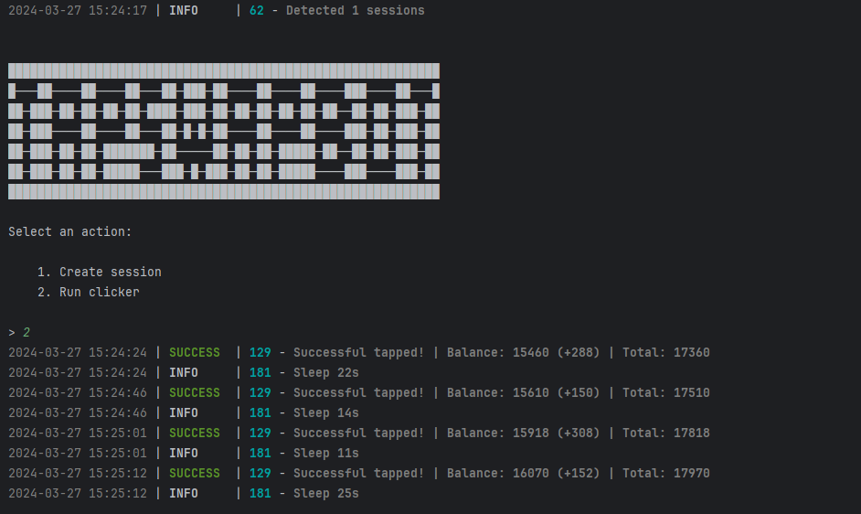

[](https://t.me/sho6ot)




> 🇷🇺 README на русском доступен [здесь](README.md)

## Functionality
| Functional                                                     | Supported |
|----------------------------------------------------------------|:---------:|
| Multithreading                                                 |     ✅     |
| Binding a proxy to a session                                   |     ✅     |
| Auto-purchase of items if you have coins (tap, energy, charge) |     ✅     |
| Random sleep time between clicks                               |     ✅     |
| Random number of clicks per request                            |     ✅     |
| Support tdata / pyrogram .session / telethon .session          |     ✅     |

## [Settings](https://github.com/shamhi/TapSwapBot/blob/main/.env-example)
| Настройка                | Описание                                                                                 |
|--------------------------|------------------------------------------------------------------------------------------|
| **API_ID / API_HASH**    | Platform data from which to launch a Telegram session _(stock - Android)_                |
| **MIN_AVAILABLE_ENERGY** | Minimum amount of available energy, upon reaching which there will be a delay _(eg 100)_ |
| **SLEEP_BY_MIN_ENERGY**  | Delay when reaching minimum energy in seconds _(eg [1800,2400])_                         |
| **ADD_TAPS_ON_TURBO**    | How many taps will be added when turbo is activated _(eg 2500)_                          |
| **AUTO_UPGRADE_TAP**     | Should I improve the tap _(True / False)_                                                |
| **MAX_TAP_LEVEL**        | Maximum level of tap pumping _(up to 20)_                                                |
| **AUTO_UPGRADE_ENERGY**  | Should I improve the energy _(True / False)_                                             |
| **MAX_ENERGY_LEVEL**     | Maximum level of energy pumping _(up to 20)_                                             |
| **AUTO_UPGRADE_CHARGE**  | Should I improve the charge _(True / False)_                                             |
| **MAX_CHARGE_LEVEL**     | Maximum level of charge pumping _(up to 5)_                                              |
| **APPLY_DAILY_ENERGY**   | Whether to use the daily free energy boost _(True / False)_                              |
| **APPLY_DAILY_TURBO**    | Whether to use the daily free turbo boost (_True / False)_                               |
| **RANDOM_CLICKS_COUNT**  | Random number of taps _(eg [50,200])_                                                    |
| **SLEEP_BETWEEN_TAP**    | Random delay between taps in seconds _(eg [10,25])_                                      |
| **USE_PROXY_FROM_FILE**  | Whether to use proxy from the `bot/config/proxies.txt` file _(True / False)_             |

## Quick Start 📚
1. To install libraries on Windows click on `INSTALL.bat`.
2. To start the bot use `START.bat` (or in console: `python main.py`).

## Prerequisites
Before you begin, ensure you have the following installed:
- [Python](https://www.python.org/downloads/) version 3.10 or 3.11

## Obtaining API Keys
1. Go to [my.telegram.org](https://my.telegram.org) and log in using your phone number.
2. Select **"API development tools"** and fill out the form to register a new application.
3. Note down the `API_ID` and `API_HASH` in `.env` file provided after registering your application.

## Installation
You can download [**Repository**](https://github.com/shamhi/TapSwapBot) by cloning it to your system and installing the necessary dependencies:
```shell
~ >>> git clone https://github.com/shamhi/TapSwapBot.git
~ >>> cd TapSwapBot

# If you are using Telethon sessions, then clone the "converter" branch
~ >>> git clone https://github.com/shamhi/TapSwapBot.git -b converter
~ >>> cd TapSwapBot

#Linux
~/TapSwapBot >>> python3 -m venv venv
~/TapSwapBot >>> source venv/bin/activate
~/TapSwapBot >>> pip3 install -r requirements.txt
~/TapSwapBot >>> cp .env-example .env
~/TapSwapBot >>> nano .env # Here you must specify your API_ID and API_HASH , the rest is taken by default
~/TapSwapBot >>> python3 main.py

#Windows
~/TapSwapBot >>> python -m venv venv
~/TapSwapBot >>> venv\Scripts\activate
~/TapSwapBot >>> pip install -r requirements.txt
~/TapSwapBot >>> copy .env-example .env
~/TapSwapBot >>> # Specify your API_ID and API_HASH, the rest is taken by default
~/TapSwapBot >>> python main.py
```

Also for quick launch you can use arguments, for example:
```shell
~/TapSwapBot >>> python3 main.py --action (1/2/3)
# Or
~/TapSwapBot >>> python3 main.py -a (1/2/3)

#1 - Create session
#2 - Run clicker
#3 - Run via Telegram
```
